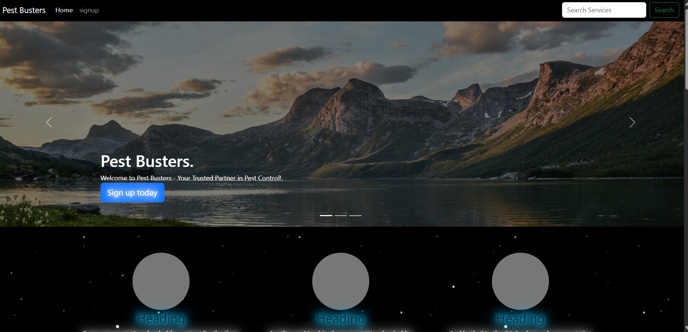
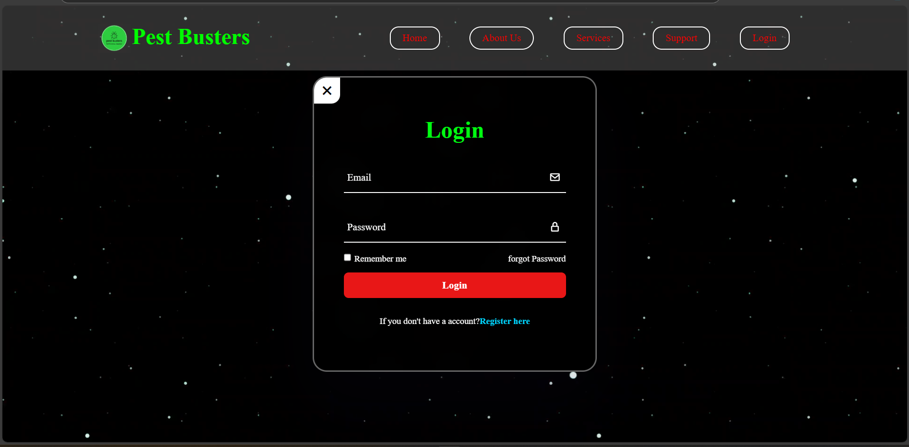
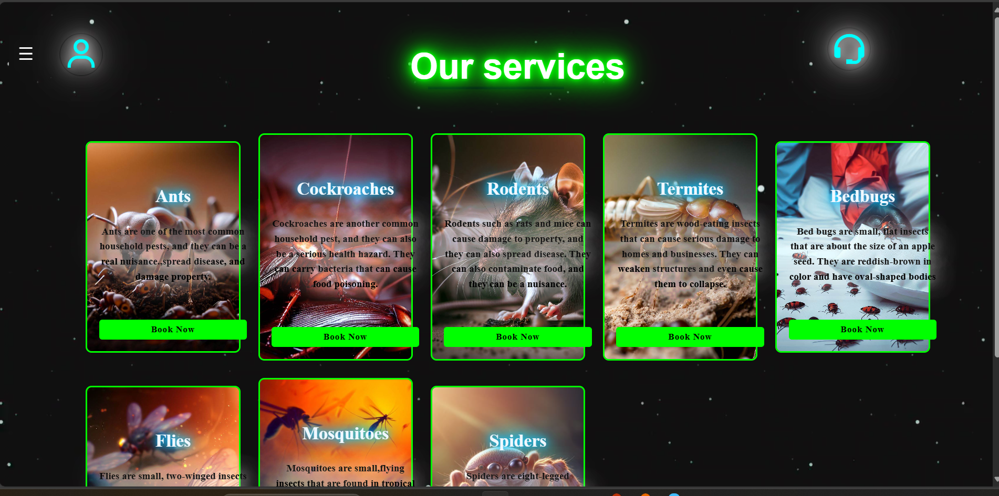
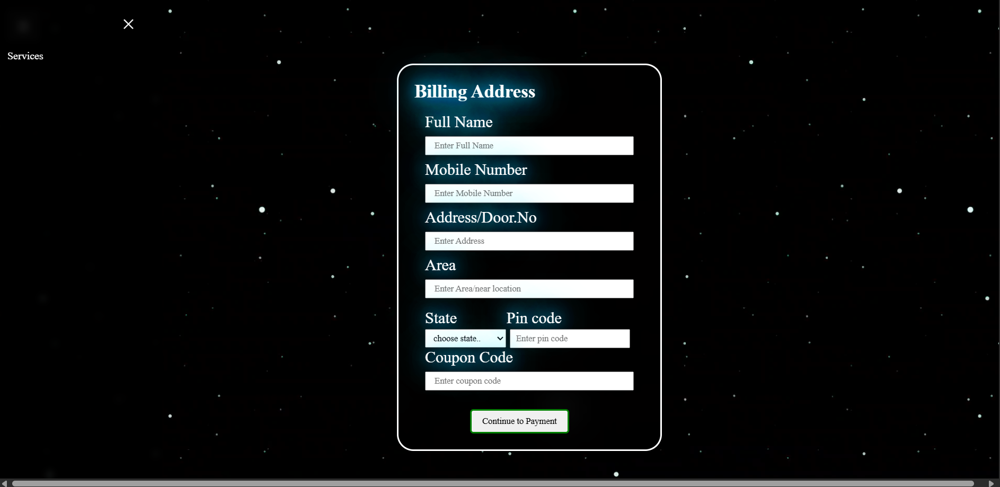

# Pest Busters | Service Booking Website

## Overview

**Pest Busters** is a service booking platform designed for users to access pest control services. The website features a user-friendly interface that allows visitors to navigate through service options, log in, select services, and make payments.

## Features

- **Homepage**: Provides an overview of available pest control services and general information.
- **Login/Sign-Up**: User authentication interface for accessing personalized service options.
- **Service Selection**: Users can choose specific pest control services to book.
- **Payment Page**: Integrated payment page for completing transactions.

## Technologies Used

- **HTML**: Structure and layout of the webpages.
- **CSS**: Styling for a polished and user-friendly design.
- **JavaScript**: Functionality for interactive elements.
- **Bootstrap**: Responsive design framework for optimal viewing on various devices.

## Project Structure

- `index.html`: The homepage presenting the pest control services.
- `login.html`: Login and registration page for users.
- `services.html`: Service selection page to view and choose pest control options.
- `payment.html`: Page for processing payments for selected services.
- `assets/`: Directory containing images and CSS styles.
- `js/`: JavaScript files for handling interactions.

## Screenshots

### Homepage


### Login Page


### Service Selection


### Payment Page


## Getting Started

### Prerequisites

- A modern web browser (Chrome, Firefox, etc.)

### Installation

1. **Clone the repository**:
   ```bash
   git clone https://github.com/yourusername/pest-busters.git
   cd pest-busters
   ```

2. **Open the project**:  
   Open `index.html` in your web browser to explore the service options.

## Future Enhancements

- **Backend Integration**: Implement server-side logic for managing user accounts and service bookings.
- **Mobile Optimization**: Enhance responsive design for better mobile and tablet support.

## Author

- **HAMANPURE VAIBHAV**

  
